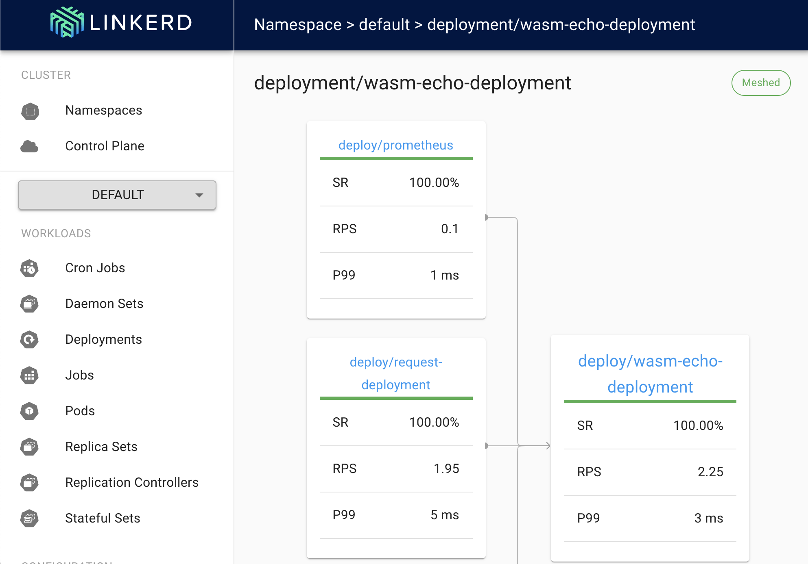

# Run WebAssembly in KinD with linkerd servicemesh
> ⚠️ WARNING: This example uses the experimental KinD node image

```bash
# Set up KinD cluster with WebAssembly support
kind create cluster --image ghcr.io/liquid-reply/kind-crun-wasm:experimental
```

## Install Linkerd
To install linkerd the best option is to follow the official [getting started](https://linkerd.io/latest/getting-started/) of Linkerd.

```bash
# Install linkerd CLI e.g. with brew
brew install linkerd
# Install Linkerd in cluster
linkerd version
linkerd check --pre
linkerd install | kubectl apply -f -
linkerd check
#Install Linkerd-viz 
linkerd viz install | kubectl apply -f -
linkerd check
# Start the dashboard
linkerd viz dashboard&
```

## Deploy example app
```bash
# Install the wasm-echo demo and inject sidecars
cat wasm-echo.yaml | linkerd inject - | kubectl apply -f -
```

The example app consists of the [wasmedge_wasi_socket/http_server](https://github.com/second-state/wasmedge_wasi_socket/tree/main/examples/http_server) example and a curl container that sends two requests per second. In the linkerd dashboard it schould show up as follows:

